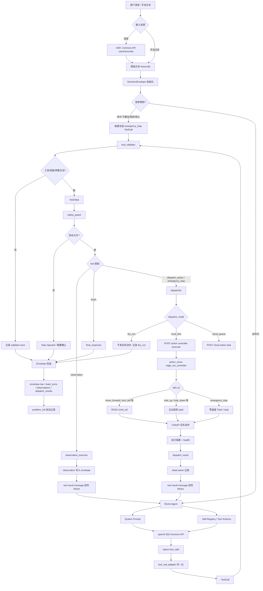
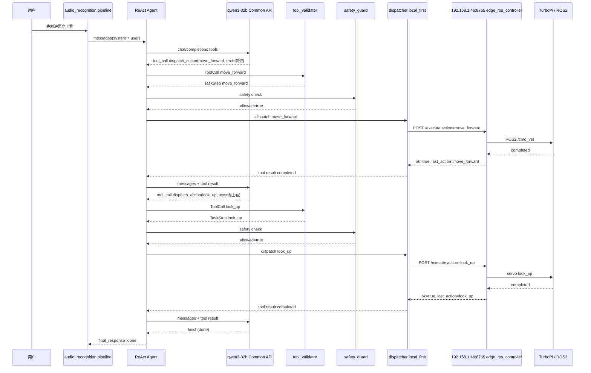
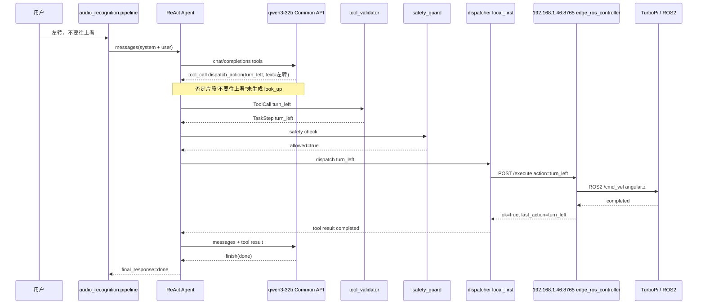
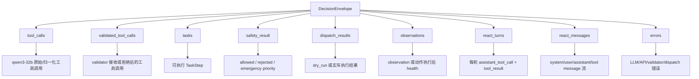

# 2026-05-24 qwen3-32b WALL-E 实车数据链路流程图

## 总览



## 实车链路细节

```mermaid
flowchart LR
    A[audio_recognition pipeline] --> B[dispatch_task local_first]
    B --> C[HTTP POST http://192.168.1.46:8765/execute]
    C --> D[action_move edge_ros_controller]
    D --> E[turbopi Docker container]
    E --> F[ROS2 Humble]
    F --> G1[/cmd_vel]
    F --> G2[/ros_robot_controller/pwm_servo/set_state]
    G1 --> H1[底盘移动/转向]
    G2 --> H2[摄像头云台]
    H1 --> I[执行结果]
    H2 --> I
    I --> J[GET /health]
    J --> K[写入 dispatch_results / observations]
```

## 两条已验证指令的数据路径

### 1. `先前进再向上看`



结果：

```text
move_forward completed action_ok=true
look_up completed action_ok=true
finish done
```

### 2. `左转，不要往上看`



结果：

```text
turn_left completed action_ok=true
finish done
look_up 未生成、未验证、未派发、未执行
```

## 关键运行时状态



## 真实服务拓扑

```mermaid
flowchart TD
    A[本机 / WSL Claude Code] -->|SSH alias| B[raspberrypi]
    B -->|IP| C[192.168.1.46]
    C --> D[systemd action-move-controller.service]
    D --> E[docker exec -u ubuntu turbopi]
    E --> F[edge_ros_controller.py]
    F -->|listen| G[0.0.0.0:8765]
    A -->|HTTP /health, /execute| G
    F --> H[ROS2 in turbopi container]
    H --> I[/cmd_vel]
    H --> J[servo topic]
```

## 修复后的关键链路

```text
Claude Code / WSL
-> http://192.168.1.46:8765/execute
-> action-move-controller.service
-> docker exec -u ubuntu turbopi
-> edge_ros_controller.py --host 0.0.0.0 --port 8765
-> ROS2 publisher
-> TurboPi 实车
```

## 文件关联

```text
audio_recognition/react_agent.py           qwen3-32b ReAct agent、system prompt、tool_calls 调用
audio_recognition/pipeline.py              多 turn ReAct 主链路
audio_recognition/tool_schema.py           tools schema 生成
audio_recognition/tool_call_adapter.py     native tool_calls 归一化
audio_recognition/tool_validator.py        工具、技能、参数校验
audio_recognition/safety_guard.py          急停、否定片段、动作数量、置信度等安全约束
audio_recognition/dispatcher.py            dry_run / cloud_queue / local_first 派发
audio_recognition/observation_executor.py  camera/state/confirmation 观察类工具
audio_recognition/react_regression_check.py qwen3-32b dry-run 和实车验证脚本
action_move/edge_ros_controller.py         树莓派实车动作 HTTP 控制器
action_move/skill_catalog.json             实车动作技能目录
audio_recognition/skills/registry.yaml     ReAct 暴露给模型的技能白名单
```
